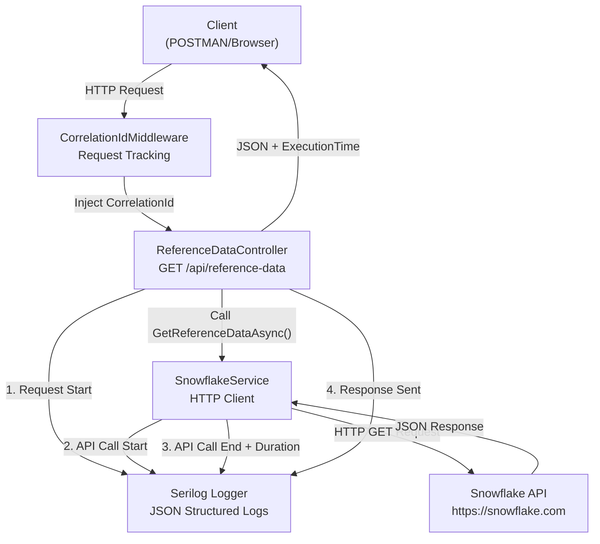
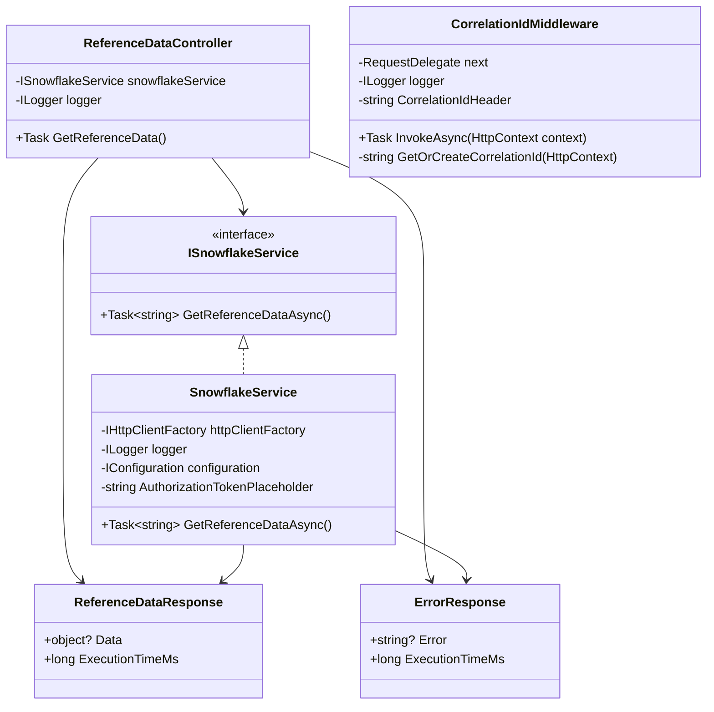

# Reference Data Service

## Project Context

This project addresses a performance optimization challenge in an existing application with the following tech stack:
- **Frontend**: React.js
- **Middleware**: .NET Microservices
- **Database**: Oracle 19c

### Current Challenge
The application currently receives static and reference data from AWS Snowflake through batch processes using Informatica jobs. This process is extremely resource-intensive, running weekly for 16-20 hours and dumping large volumes of data into the Oracle database.

### Proposed Solution
Instead of heavy weekly batch synchronization, the **Reference Data Service** implements an on-demand API approach:
- Fetch reference data from Snowflake **when needed** by users
- Eliminate heavy batch processing overhead
- Reduce database load and storage requirements
- Provide real-time data availability
- Measure end-to-end performance metrics

This POC service will:
1. Create a .NET microservice with an API endpoint to call Snowflake
2. Measure request/response times (end-to-end)
3. Integrate with React frontend for displaying data in dropdowns
4. Enable performance analysis and optimization

---

## Project Summary

**Reference Data Service** is a .NET 8 Web API service that provides on-demand access to reference data from Snowflake. It includes comprehensive logging, performance monitoring, and error handling capabilities.

### Key Features

✅ **RESTful API** - Clean, simple endpoint for data retrieval  
✅ **Performance Monitoring** - Measures and logs execution times  
✅ **Structured Logging** - JSON-based logging with correlation IDs  
✅ **Error Handling** - Comprehensive error management with specific HTTP status codes  
✅ **Swagger/OpenAPI** - Interactive API documentation  
✅ **Dependency Injection** - HttpClientFactory for scalable HTTP operations  
✅ **Structured Configuration** - Externalized settings via appsettings.json  

---

## Architecture & Components

### Project Structure

```
ReferenceDataService/
├── Program.cs                              # Application entry point & DI setup
├── appsettings.json                        # Configuration (Serilog, API URLs)
├── ReferenceDataService.csproj             # Project file with NuGet dependencies
├── README.md                               # This file
│
├── Controllers/
│   └── ReferenceDataController.cs          # API endpoint handler
│
├── Services/
│   ├── ISnowflakeService.cs               # Service interface definition
│   └── SnowflakeService.cs                # Snowflake API client implementation
│
├── Models/
│   └── ExternalApiResponse.cs             # Request/response DTOs
│
└── Middleware/
    └── CorrelationIdMiddleware.cs         # Request correlation tracking
```

### Component Descriptions

#### 1. **Program.cs** - Application Bootstrap
- Configures Serilog for structured JSON logging
- Registers services in DI container
- Initializes middleware pipeline
- Graceful shutdown handling

#### 2. **Controllers/ReferenceDataController.cs** - API Endpoint
- Route: `GET /api/reference-data`
- Groups all HTTP concerns (routing, status codes, response models)
- Delegates business logic to service layer
- Measures and reports execution time
- Returns JSON responses with performance metrics

#### 3. **Services/ISnowflakeService.cs** - Service Interface
- Defines contract for Snowflake API operations
- Method: `Task<string> GetReferenceDataAsync()`
- Returns raw JSON string from external API

#### 4. **Services/SnowflakeService.cs** - Service Implementation
- Implements HTTP communication with Snowflake API
- Uses `IHttpClientFactory` for client creation
- Manages timeout and authorization headers
- Handles multiple exception types with meaningful error messages
- Logs all request/response details with Stopwatch timing
- Returns raw JSON response string

#### 5. **Models/ExternalApiResponse.cs** - Response Models
- `ReferenceDataResponse` - Success response with data and execution time
- `ErrorResponse` - Error response with error message and execution time

#### 6. **Middleware/CorrelationIdMiddleware.cs** - Request Tracking
- Generates unique correlation ID for each request
- Extracts correlation ID from headers if provided
- Integrates with Serilog LogContext
- Adds correlation ID to response headers
- Enables request tracing across logs

#### 7. **appsettings.json** - Configuration
- Serilog logging configuration with JSON formatting
- External API (Snowflake) settings (URL, timeout)
- Log level settings

---

## System Architecture Diagram



---

## Class Diagram



---

## API Endpoints

### GET /api/reference-data

Retrieves reference data from Snowflake API with performance metrics.

#### Request
```http
GET /api/reference-data HTTP/1.1
Host: localhost:5001
Accept: application/json
X-Correlation-ID: optional-correlation-id
```

#### Success Response (200 OK)
```json
{
  "data": {
    "items": [
      { "id": 1, "name": "Product A" },
      { "id": 2, "name": "Product B" }
    ]
  },
  "executionTimeMs": 245
}
```

#### Error Response (408 Request Timeout)
```json
{
  "error": "Request timeout while calling Snowflake API",
  "executionTimeMs": 30000
}
```

#### Error Response (503 Service Unavailable)
```json
{
  "error": "Failed to connect to Snowflake API",
  "executionTimeMs": 5000
}
```

#### HTTP Status Codes
| Code | Scenario |
|------|----------|
| 200 | Data retrieved successfully |
| 408 | Request timeout at Snowflake API |
| 503 | Connection failure to Snowflake |
| 500 | Unexpected error or API error |

---

## Logging

The service uses **Serilog** with **JSON structured logging** and **correlation IDs** for request tracing.

### Log Levels
- **Information**: Request received, API calls started/completed, successful operations
- **Warning**: API errors, connection issues
- **Error**: Exceptions, failed requests, timeouts

### Sample Log Output (JSON Format)
```json
{
  "@t": "2026-03-30T10:30:45.1234567Z",
  "@m": "HTTP request received - Method: GET, Path: /api/reference-data, CorrelationId: trace-abc-123",
  "@l": "Information",
  "Application": "ReferenceDataService",
  "MachineName": "DEV-WORKSTATION",
  "ThreadId": 12,
  "CorrelationId": "trace-abc-123"
}
```

### Log Events

| Event | Location | Details |
|-------|----------|---------|
| Request Received | CorrelationIdMiddleware | HTTP method, path, remote IP |
| API Call Start | SnowflakeService | Base URL, timeout, timestamp |
| HTTP Request Sent | SnowflakeService | URI, headers (Authorization, Accept) |
| Response Received | SnowflakeService | Status code, timestamp, duration |
| Response Sent | Controller | HTTP status, total execution time |

---

## Setup Instructions

### Prerequisites

1. **.NET 8 SDK** installed ([Download](https://dotnet.microsoft.com/download/dotnet/8.0))
2. **Visual Studio**, **VS Code**, or any .NET IDE
3. **Git** (optional, for version control)
4. **Postman** or **cURL** (for API testing)

### Installation Steps

#### Step 1: Navigate to Project Directory
```bash
cd c:\Code\ReferenceDataService
```

#### Step 2: Restore NuGet Packages
```bash
dotnet restore
```

This downloads all dependencies specified in `.csproj`:
- Swashbuckle.AspNetCore (Swagger)
- Serilog & logging extensions
- Framework libraries

#### Step 3: Build the Project
```bash
dotnet build
```

Compiles the project and verifies there are no compilation errors.

#### Step 4: (Optional) Publish for Production
```bash
dotnet publish -c Release -o ./bin/publish
```

Creates an optimized release build.

---

## Running the Application

### Development Mode

```bash
dotnet run
```

**Output**:
```
info: Program[0]
      Starting ReferenceDataService application
info: Microsoft.Hosting.Lifetime[14]
      Now listening on: https://localhost:5001
```

### Access Points

| Resource | URL |
|----------|-----|
| API Endpoint | `https://localhost:5001/api/reference-data` |
| Swagger UI | `https://localhost:5001/swagger/ui/index.html` |
| Health Check | `https://localhost:5001` (redirects to Swagger) |

### Testing with Swagger UI

1. Navigate to `https://localhost:5001/swagger/ui/index.html`
2. Click on `GET /api/reference-data`
3. Click **"Try it out"**
4. Click **"Execute"**
5. Observe response:
   - `data` object with Snowflake API response
   - `executionTimeMs` showing total time in milliseconds

### Testing with Postman

1. Create new GET request
2. URL: `https://localhost:5001/api/reference-data`
3. Headers:
   ```
   Accept: application/json
   X-Correlation-ID: my-request-123
   ```
4. Click **Send**
5. Check response and **Body** and console logs

### Testing with cURL

```bash
curl -X GET "https://localhost:5001/api/reference-data" \
  -H "Accept: application/json" \
  -H "X-Correlation-ID: curl-test-001" \
  -k
```

(Use `-k` flag to ignore SSL certificate warnings in development)

---

## Configuration

### appsettings.json

Edit `appsettings.json` to customize:

```json
{
  "ExternalApi": {
    "SnowflakeBaseUrl": "https://snowflake.com",    // Snowflake API URL
    "TimeoutSeconds": 30                             // Request timeout
  },
  "Serilog": {
    "MinimumLevel": "Information"                     // Log level
  }
}
```

### Environment-Specific Settings

For production, create `appsettings.Production.json`:
```json
{
  "ExternalApi": {
    "SnowflakeBaseUrl": "https://actual-snowflake-prod.com",
    "TimeoutSeconds": 60
  }
}
```

---

## Authorization Token Setup

The service includes a placeholder for Snowflake authentication token.

### How to Configure

1. Open `Services/SnowflakeService.cs`
2. Find line with `AuthorizationTokenPlaceholder`
3. Replace with your actual token:

```csharp
private const string AuthorizationTokenPlaceholder = "Bearer YOUR_ACTUAL_SNOWFLAKE_TOKEN";
```

Or better, use environment variables:

```csharp
private string _authorizationToken = Environment.GetEnvironmentVariable("SNOWFLAKE_AUTH_TOKEN") 
    ?? "Bearer YOUR_SNOWFLAKE_AUTH_TOKEN_HERE";
```

---

## Troubleshooting

### Issue: "No .NET SDKs were found"
**Solution**: Install .NET 8 SDK from https://dotnet.microsoft.com/download

### Issue: HTTPS certificate warning
**Solution**: In development, use `-k` flag with cURL or accept the warning in browser

### Issue: Connection refused (Snowflake API)
**Solution**: 
- Verify Snowflake API URL in `appsettings.json`
- Check network connectivity
- Verify authorization token is correct
- Check firewall/proxy settings

### Issue: Request timeout
**Solution**:
- Increase `TimeoutSeconds` in `appsettings.json`
- Check Snowflake API response time
- Verify network latency

### Issue: "Module not found" error
**Solution**: Run `dotnet restore` to install missing packages

---

## Development Workflow

### Debug Mode (with breakpoints)

Using Visual Studio:
1. Open `ReferenceDataService.sln` (if exists)
2. Press **F5** or **Debug > Start Debugging**
3. Set breakpoints by clicking left margin
4. Hit endpoint via browser or Postman

Using VS Code:
1. Install **C# Dev Kit** extension
2. Open folder: `c:\Code\ReferenceDataService`
3. Press **F5** or **Run > Start Debugging**
4. Select **.NET** environment

### Watch Mode

For auto-restart on code changes:
```bash
dotnet watch run
```

---

## Performance Metrics Interpretation

The API returns `executionTimeMs` which measures:
1. **Service Layer**: Call to Snowflake API + data parsing
2. **Controller Layer**: Request handling + response serialization
3. **Network**: Round-trip time to Snowflake API

### Example Performance Analysis

```
Request Time: 245ms
├── Snowflake API Call: 200ms
├── JSON Parsing: 30ms
└── Response Serialization: 15ms
```

Use this data to:
- Monitor API performance trends
- Identify bottlenecks
- Optimize caching strategies
- Detect network issues

---

## Next Steps

### Phase 2: React Frontend Integration
- Create React component with dropdown
- Call this API endpoint
- Display retrieved data
- Measure UI render time

### Phase 3: Caching Layer
- Implement in-memory caching
- Add cache expiration policies
- Reduce API calls to Snowflake

### Phase 4: Database Integration
- Store reference data in Oracle
- Implement hybrid approach (cache + DB)
- Add update synchronization

---

## Dependencies

| Package | Version | Purpose |
|---------|---------|---------|
| Swashbuckle.AspNetCore | 6.4.0 | Swagger/OpenAPI documentation |
| Serilog.AspNetCore | 7.0.0 | ASP.NET Core logging integration |
| Serilog.Sinks.Console | 4.1.0 | Console output for logs |
| Serilog.Formatting.Compact | 2.0.0 | JSON log formatting |
| Serilog.Enrichers.Environment | 2.3.0 | Machine name enrichment |
| Serilog.Enrichers.Thread | 3.1.0 | Thread ID enrichment |

---

## Code Examples

### Example 1: Making API Call from React

```javascript
async function getReferenceData() {
  const correlationId = generateUUID();
  
  const response = await fetch('https://localhost:5001/api/reference-data', {
    method: 'GET',
    headers: {
      'Accept': 'application/json',
      'X-Correlation-ID': correlationId
    }
  });
  
  const result = await response.json();
  console.log(`Execution time: ${result.executionTimeMs}ms`);
  console.log('Data:', result.data);
}
```

### Example 2: Custom Correlation ID Tracking

```bash
# Request with custom correlation ID
curl -X GET "https://localhost:5001/api/reference-data" \
  -H "X-Correlation-ID: frontend-request-2026-001" \
  -k

# Response includes correlation ID in headers
# X-Correlation-ID: frontend-request-2026-001
```

---

## Support & Resources

- **.NET Documentation**: https://learn.microsoft.com/dotnet/
- **Serilog Documentation**: https://serilog.net/
- **ASP.NET Core**: https://learn.microsoft.com/aspnet/core/
- **Swagger/OpenAPI**: https://swagger.io/

---

## License

This project is proprietary and part of the Snowflake connectivity POC.

---

## Contact

For questions or issues, contact the development team.

**Last Updated**: March 30, 2026

